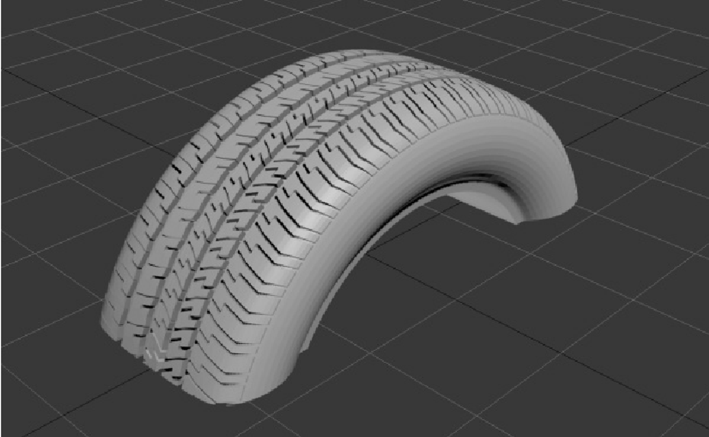
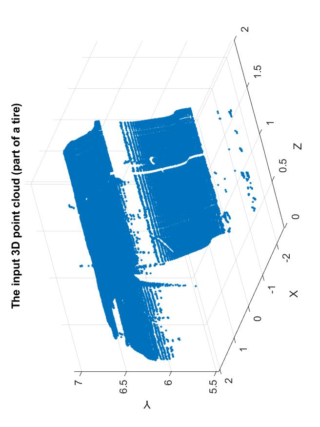
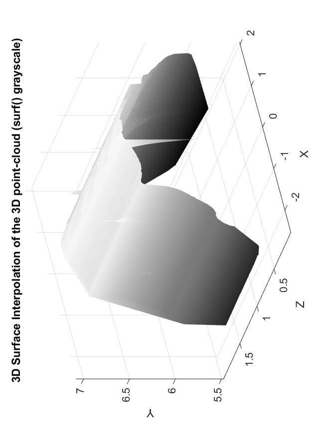
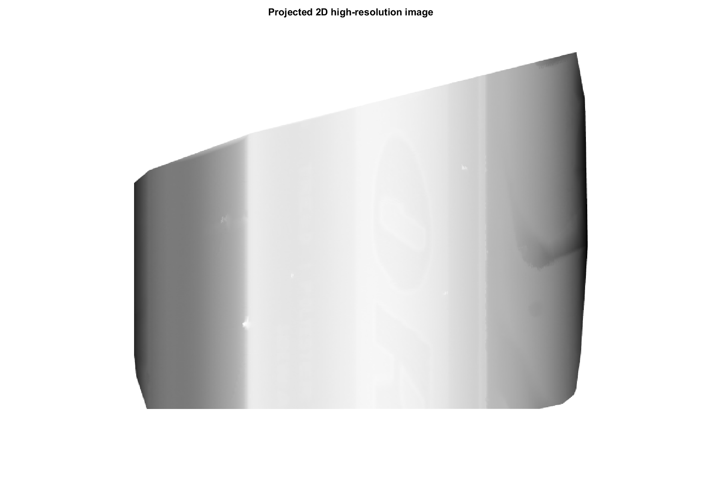
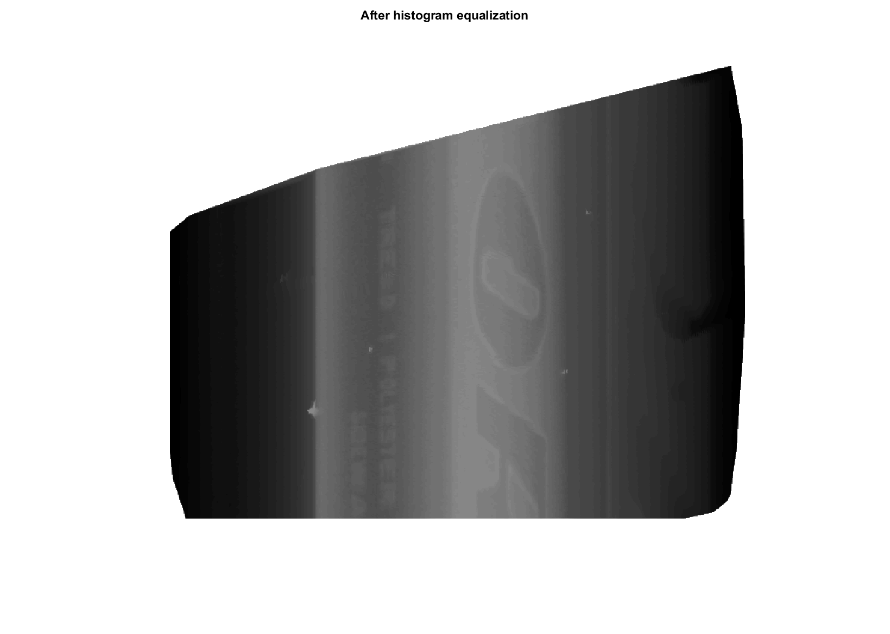
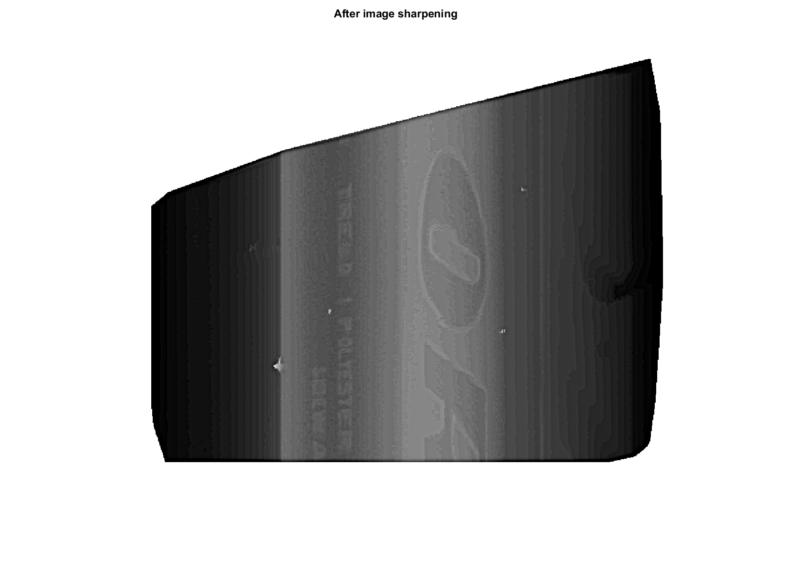
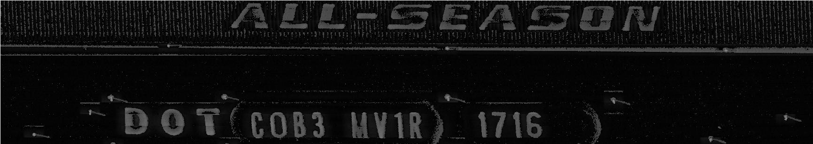
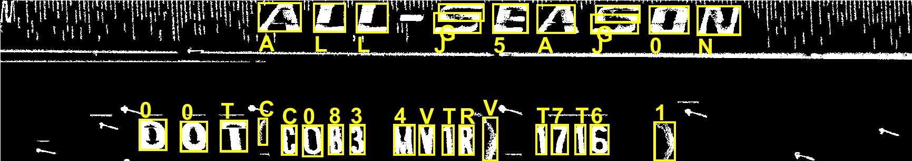

# 3D-Point Cloud Processing & Applications in Matlab

## 1. Objective

The objective of this project is to demonstrate how to construct high-resolution 2D images from 3D point cloud and apply OCR on the constructed 2D image to detect text.

## 2. Motivation

In most depth measurements applications, only 3D point cloud data is collected. However, in some of these application may require higher resolution of objects of interest for computer processing and applications. For instance, consider a tire inspection application using 3D point cloud to examine the correct measurements of manufactired tires at the product line. In such application, there is a need to scan the tires and extract additional features, properties and identifiers from each inspected tire. These features include text and codes imprinted on the tires, such as the Department of Transportation (DOT) code, which certifies the tire manufacturer's compliance with government regulations. Extracting these codes requires optical character recognition algorithms, which will not work on 3D point cloud data and require higher resolution 2D images of the tires. 

In this project, we shall demonstrate how to construct high-resolution 2D images from 3D point cloud and use apply OCR on the constructed 2D image to detect text.

## 2. The Input 3D Point Cloud

The input point cloud data representatiuon of part of a tire is illustrated in the next figure

## 3. Approach

As demonstrated in the submitted code, we implemented the following 3-step process to generated high-resolution 2D images from the relatively sparse 3D point cloud, illustrated in the fugure above:

1. Fit high resolution surface models to the 3D point cloud
2. Project 3D high resolution surface to a high resolution 2D image
3. Enhance the quality of the constructed high resolution 2D image.

### 3.1 Fitting High-Resolution Surface to the 3D Point-Cloud

We make use of MATLAB 3D surface interpolation and fitting to constrctt high-resolution surface from the reklatively sparse 3D point cloud, as illustrated in the next figure.

### 3.2 Projecting the 3D High Resolution Surface to a High Resolution 2D Image

We then project the constructed high-resolution 3D surface 3D down to 2D high resolution from a top-down perspective, as illustrated in the next figure.

### 3.3 Enhancing the Quality of the Constructed High Resolution 2D Image

In order to enhance the quality of the constrcucted high resolutuion 2D image, we apply two simple image enhancement transformation, using MATLAB built-in functions:

* Histogram equalization
* Image sharpening

The output images after applying these enahnecmenet operations consecutively are illutrated next.

## 4. Text Detection from the Constructed High-Resolution 2D Image

The printed text on the constructed and enhanced 2D reolution image can now be detected using OCR algorithms. The figures below illustrated another reconstructed and enhanced 2D high resolution image and the OCR text detection results extracted from this image, respectively.

Using the MATLAB OCT built-in functionality, we are able to extract reasonable accurate text detection results from the high-resolution image.

## 5. Analysis

In this mini-project, we demonstrated a simple yet practical proof of concept of constructing high resolution 2D images from 3D point cloud and using the constructed high resolution image for computer vision applications, such text detection using OCR. In some depth-based applications, this may reduce or eliminates the need for additional vision imaging systems since we may be able to extract additional information from the high resolution 2D images reconstructed from the acquired 3D point cloud.

## 6. Future Work

We plan to continue to explore and develop algorithms for 3D point-could processing and applications, including:

Exploring more advanced OCR algorithms to detect and recognize characters imprinted on tires
Exploring more advanced super-resolution techniques to construct higher quality 2D images from the 3D point data

## 7. References

1. FME Community. Tutorial: Getting Started with Point Clouds. Retrieved from: https://community.safe.com/s/article/point-cloud-tutorial.
2. Universitat Wurzburg. Large-Scale 3D Point Cloud Processing Tutorial 2013 Retrieved from: http://kos.informatik.uni-osnabrueck.de/icar2013/.
3. Miguel Molaro. Awesome Point-cloud Processing. Retrieved from: https://github.com/mmolero/awesome-point-cloud-processing.
4. Geospatial Awareness Hub. Essentials of LiDAR Point Cloud Processing Using Python. Retrieved from: https://geospatialawarenesshub.com/blog/essentials-of-lidar-point-cloud-processing-using-python/.
5. Earth Lab. Lesson 2. Get to know Lidar (Light Detection and Ranging) Point Cloud Data - Active Remote Sensing. Retrieved from: https://www.earthdatascience.org/courses/use-data-open-source-python/data-stories/what-is-lidar-data/explore-lidar-point-clouds-plasio/.
6. Sofia Kelly. How to Automate LiDAR point Cloud Processing with Python. Retrieved from: https://morioh.com/p/d8ca5ecd9166.
7. GitHub. Lidar- Point-cloud. Retrieved from: https://github.com/topics/lidar-point-cloud.
